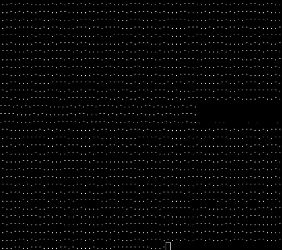

# GOTO10

My interpretation of the famous one-line Commodore 64 BASIC program: `10 PRINT CHR$(205.5+RND(1)); : GOTO 10`

Currently this only contains the C, C++, and Python interpretations. I will try to include other interpretations in different languages in the future.

# C

```c
#include <stdio.h>
int main(){while(1) {printf("%c", 47 + 45*(rand()%2));}}
```

# C++

``` cpp
#include <iostream> 
int main() { while(true) { std::cout << static_cast<char>(47 + 45*(rand()%2)); } }
```
# Python

```python
import random
while(1):
	print (chr(47 + 45 * random.randint(0,1)), end=" ")
```

# Some GIFs

### Backward Forward Slashes

Classic, unfiltered

<p align="center">
  
</p>

### Morse code

With some over-the-top GIPHY filters

<p align="center">
	
	
</p>
