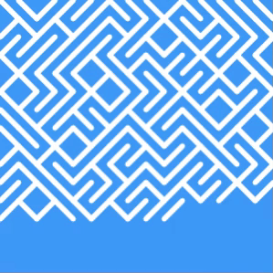

# GOTO10

My interpretations in different languages of the famous one-line Commodore 64 BASIC program: `10 PRINT CHR$(205.5+RND(1)); : GOTO 10`

Currently this only contains the Processing, C, C++, and Python interpretations. I will try to include other interpretations in different languages in the future.

# Processing

```pde
int cellWidth = 20;

void setup() {
  size(300, 300);
  strokeWeight(6);
  stroke(255);
  background(color(#3496FE));
}

int x = 0, y = 0;

void draw() {
  if(boolean((int)random(2)))
    drawBackwardSlash(x, y);
  else
    drawForwardSlash(x, y);
    
  x += cellWidth;
  if (x >= width) {
    x = 0;
    y += cellWidth;
    if (y >= height) {
      y = 0;
      x = 0;
      background(color(#3496FE));
    }
  }
  
}

// Draw "\"
void drawBackwardSlash(int topLeftX, int topLeftY) {
  line(topLeftX, topLeftY, topLeftX + cellWidth, topLeftY + cellWidth);
}

// Draw "/"
void drawForwardSlash(int topLeftX, int topLeftY) {
  line(topLeftX, topLeftY + cellWidth, topLeftX + cellWidth, topLeftY);
}
```

# C

```c
#include <stdio.h>
int main(){while(1) {printf("%c", 47 + 45*(rand()%2));}}
```

# C++

``` cpp
#include <iostream> 
int main() { while(true) { std::cout << static_cast<char>(47 + 45*(rand()%2)); } }
```
# Python

```python
import random
while(1):
	print (chr(47 + 45 * random.randint(0,1)), end=" ")
```

# Some GIFs

### Backward Forward Slashes

Classic, made with Processing

<p align="center">
  
</p>

Classic, terminal

<p align="center">
  
</p>

### Morse code

With some over-the-top GIPHY filters

<p align="center">
	
	
</p>
